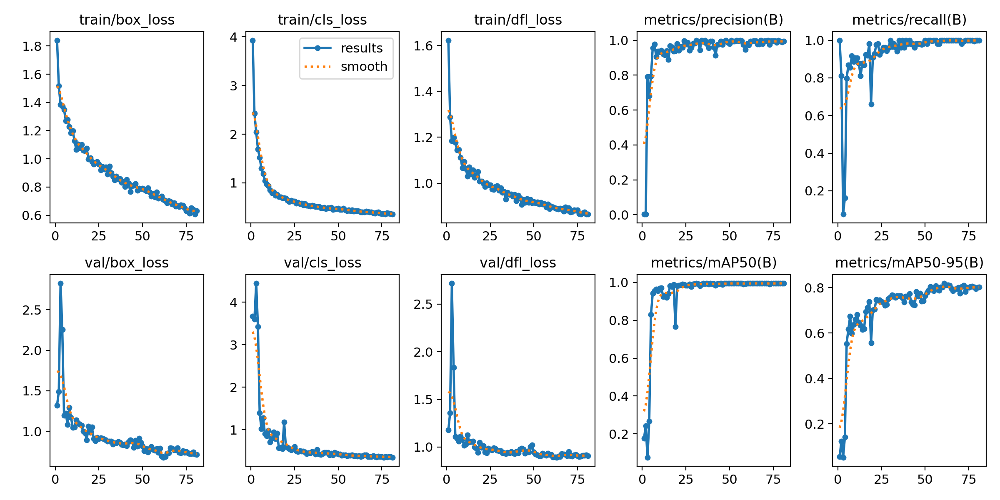
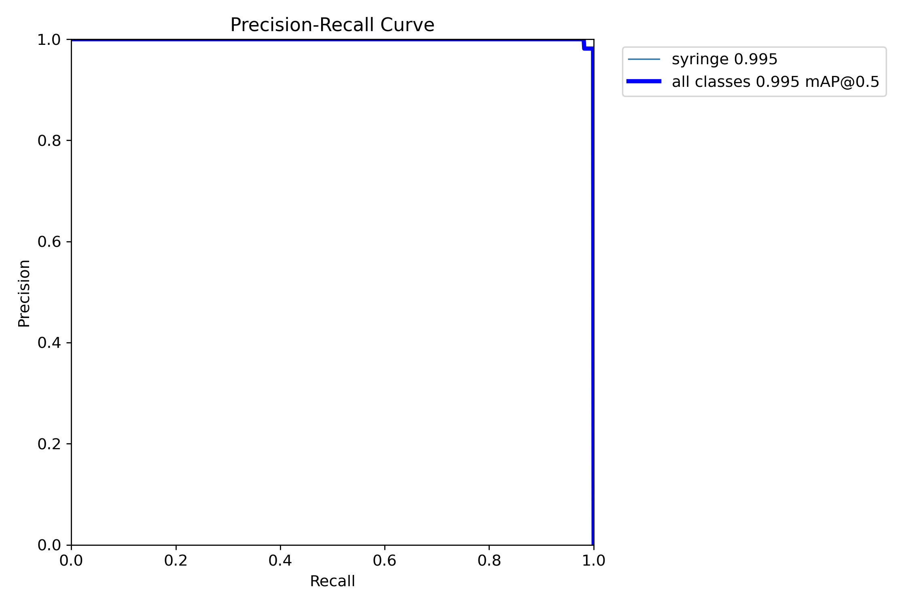
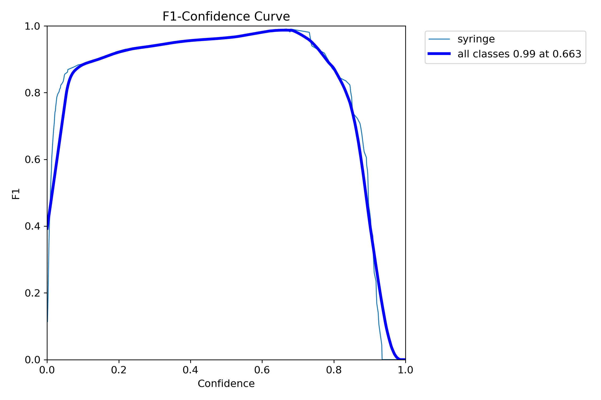
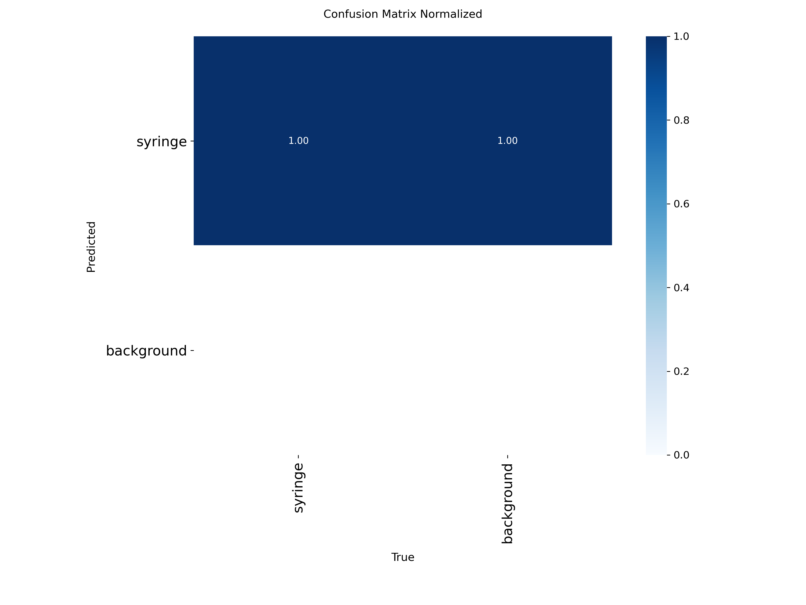
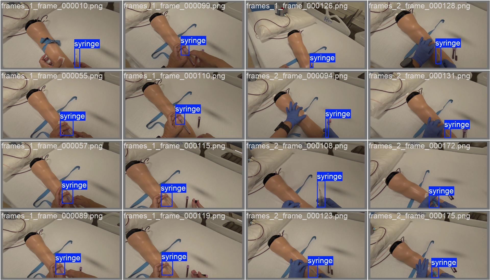
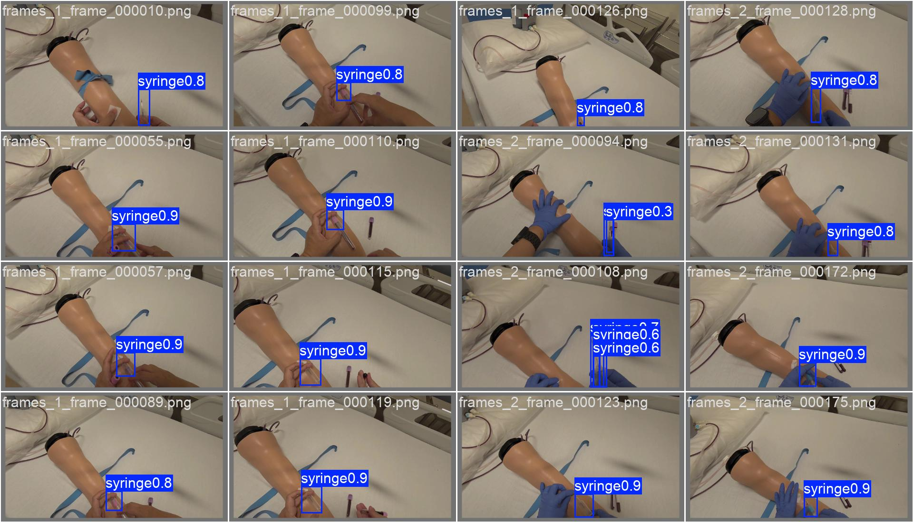
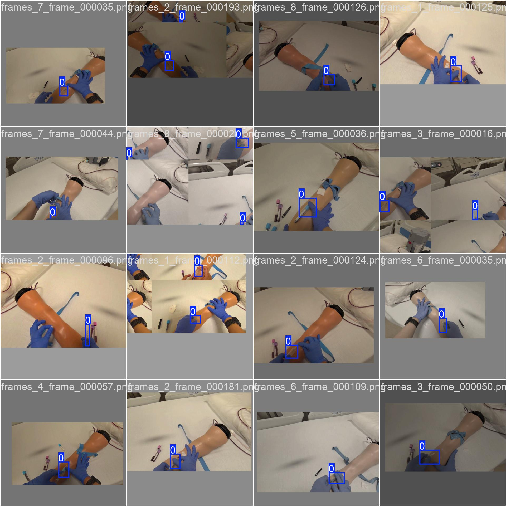

# VPIC — Venepuncture & IV Cannulation Object Detection

Part of the **VPIC AI-assisted AR/VR Training System** — a broader project building a real-time syringe and needle tracking pipeline for venepuncture and IV cannulation training on Meta Quest 3 and Apple Vision Pro.

This repository covers the **computer vision / object detection** component: dataset preparation, YOLOv8n model training, evaluation, and Unity integration for on-device AR inference.

---

## Project Overview

```
VPIC/
├── VPIC_DataPipeline.ipynb      # Data extraction, stats, visualisation, train/val/test split
├── VPIC_TrainEvalTest.ipynb     # Training, evaluation, test inference, ONNX export
├── requirements.txt             # Python dependencies
├── Unity/
│   ├── VPIC_YOLOv8Detector.cs  # Unity Sentis inference script (C#)
│   └── VPIC_Quest3_Setup.md    # Step-by-step Unity + Quest 3 setup guide
└── .gitignore
```

> `data/`, `vpic_dataset/`, `runs/`, and `venv/` are excluded from version control via `.gitignore` due to file size.

---

## System Architecture

```
Stereo Camera (Quest 3 Passthrough)
        │
        ▼
 Frame Preprocessing
  (640×640 resize, normalise)
        │
        ▼
  YOLOv8n ONNX Model
  (Unity Sentis, GPU inference)
        │
        ▼
 Detection Decoding + NMS
        │
        ▼
 AR Bounding Box Overlay
  (Screen Space Canvas, passthrough)
        │
        ▼
 Real-time Feedback to Trainee
```

---

## Dataset

- **Class:** `syringe` (single class, class ID 0)
- **Annotation format:** YOLO normalised `.txt` (cx cy w h)
- **Recording sessions:** 8 (`frames_1` through `frames_8`)
- **Total labelled pairs:** ~589 image + label pairs
- **Split:** 80% train / 10% val / 10% test (stratified by session)

| Split | Images |
|---|---|
| Train | 469 |
| Val | 53 |
| Test | 67 |

---

## Model Results

Trained with **YOLOv8n** (nano) on 469 images for 81 epochs (early stopping, patience 20).

| Metric | Score |
|---|---|
| mAP@0.5 | **99.4%** |
| mAP@0.5:0.95 | **81.9%** |
| Precision | 97.3% |
| Recall | **100%** |
| Best epoch | 61 |

The model converged to mAP@0.5 ≥ 0.99 by epoch 23 and maintained 100% recall — no missed detections on the validation set.

---

## Training Findings

### Training Curves



All loss metrics (box, class, DFL) converge smoothly across train and val sets with no sign of overfitting. mAP@0.5 reaches ≥ 0.99 by epoch 23 and stays there.

### Precision-Recall Curve



Area under the PR curve = **0.994** — the model maintains near-perfect precision across the full recall range.

### F1 Curve



Peak F1 score of **0.98** at a confidence threshold of ~0.5, confirming the model is well-calibrated with a wide operating window.

### Confusion Matrix (Normalised)



Near-perfect classification: 100% of syringe instances correctly detected, with background false positive rate effectively 0.

### Validation Predictions vs Ground Truth

| Ground Truth | Predictions |
|:---:|:---:|
|  |  |

Predictions are spatially tight and confidence scores are consistently high (≥ 0.85) across varied syringe poses and backgrounds.

### Training Batch Sample



Sample of augmented training images with YOLO bounding box labels overlaid.

---

## Quickstart

### 1. Clone and set up environment

```bash
git clone https://github.com/<your-username>/VPIC_ObjectDetection.git
cd VPIC_ObjectDetection

python -m venv venv
venv\Scripts\activate          # Windows
# source venv/bin/activate     # Mac / Linux

pip install -r requirements.txt
python -m ipykernel install --user --name=vpic --display-name "VPIC (venv)"
```

### 2. Add your data

Place your labelled frame sessions under:
```
data/
└── Syringe/
    ├── frames_1/
    │   ├── frames_1_frame_000001.png
    │   ├── frames_1_frame_000001.txt
    │   └── ...
    └── frames_2/ ... frames_8/
```

### 3. Run the data pipeline

Open `VPIC_DataPipeline.ipynb` in VS Code with the **VPIC (venv)** kernel and run all cells.
This generates `vpic_dataset/` with the YOLO-ready split and `dataset.yaml`.

### 4. Train and evaluate

Open `VPIC_TrainEvalTest.ipynb` and run all cells.
Training outputs land in `runs/vpic_syringe_v1/`. The final cell exports `best.onnx`.

### 5. Deploy to Meta Quest 3

See [`Unity/VPIC_Quest3_Setup.md`](Unity/VPIC_Quest3_Setup.md) for the full Unity + Meta XR SDK setup.
Copy `runs/vpic_syringe_v1/weights/best.onnx` and `Unity/VPIC_YOLOv8Detector.cs` into your Unity project.

---

## Dependencies

| Package | Purpose |
|---|---|
| `ultralytics` | YOLOv8 training and ONNX export |
| `torch` / `torchvision` | PyTorch backend |
| `opencv-python` | Image processing |
| `albumentations` | Training augmentation |
| `matplotlib` / `pandas` | Visualisation and metrics |
| `onnxruntime` | ONNX verification |
| Unity Sentis 2.x | On-device ML inference |
| Meta XR Core SDK | Quest 3 passthrough and XR |

See `requirements.txt` for pinned versions.

---

## Part of a Larger System

This repository is one component of the VPIC project:

| Component | Description |
|---|---|
| **Object Detection** *(this repo)* | YOLOv8n syringe tracking, Unity AR overlay |
| Stereo Camera Pipeline | Depth estimation, 3D needle position |
| React Dashboard | Real-time trainee feedback and session analytics |
| Haptic Feedback | Controller vibration on insertion events |
| Apple Vision Pro Port | Core ML export and visionOS integration |

---

## Roadmap

- [ ] Add `needle_tip` as a second detection class
- [ ] Stereo depth estimation for 3D syringe position
- [ ] WebSocket stream from Unity to React dashboard
- [ ] Retrain with `yolov8s` for higher mAP@0.5:0.95
- [ ] Apple Vision Pro — Core ML export and deployment
- [ ] Synthetic data generation for low-light conditions

---

## License

MIT
